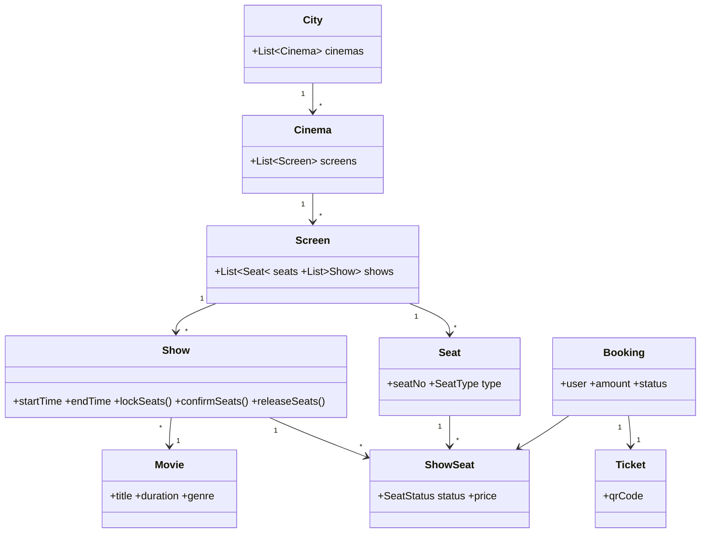
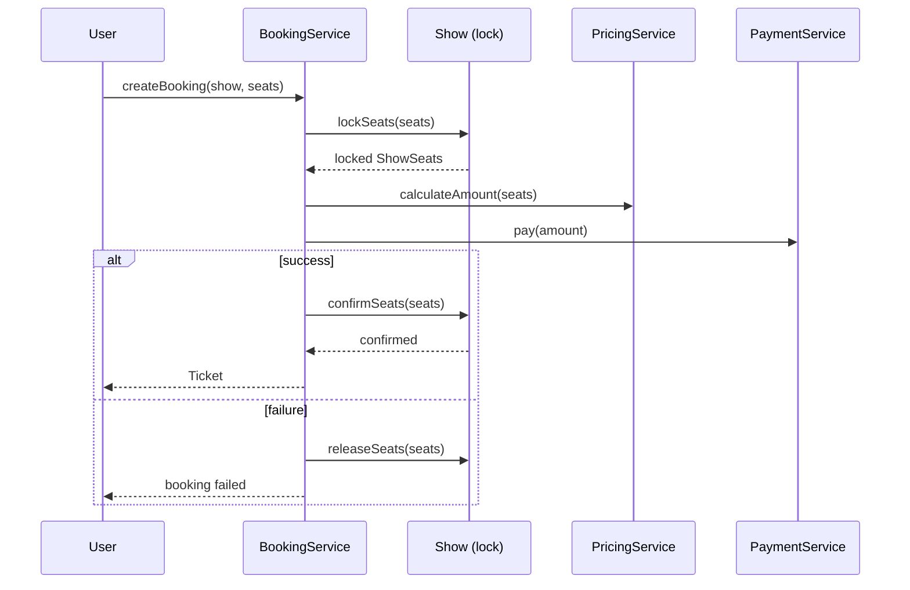

# 🎬 Movie Ticket Booking System (LLD)

A Java LLD implementation of a BookMyShow-style booking system — search shows, lock seats, handle concurrent bookings safely, and apply extensible dynamic pricing.

## ✨ What's implemented

| Feature | How |
|---|---|
| Search shows by movie + city | O(1) indexed lookup (`MovieSearchService`) instead of scanning the full tree |
| Seat selection & booking | Seat-level locking via `ShowSeat` (per-show status, decoupled from static `Seat`) |
| No double-booking | Single shared lock per `Show`, guarding lock/confirm/release as one atomic path |
| Auto-release on timeout | Scheduled task releases seats if payment isn't completed in time |
| Dynamic pricing | Strategy pattern — `WeekendPrice`, `HolidayPrice`, etc. stack automatically, no core code changes to add a new rule |
| Mock payment | Swappable `PaymentService`, ready for a real gateway later |

## 🧩 Class Diagram



## 🔁 Booking Flow



## 📁 Structure

```
DTOs/             → City, Cinema, Screen, Movie, Seat, Show, ShowSeat, Booking, Ticket
PricingStrategy/  → IPricingStrategy + WeekendPrice, HolidayPrice, ...
service/          → BookingService, MovieSearchService, PricingService, PaymentService
exceptions/       → SeatNotAvailableException
utils/            → sample data setup for local testing
Main.java         → demo run
```

## ▶️ Run

```bash
git clone https://github.com/vhack01/Movie-Booking-System-LLD-.git
cd Movie-Booking-System-LLD-
javac Main.java && java Main
```

## 🚧 Status

Learning project for LLD practice. Payment is intentionally mocked.
